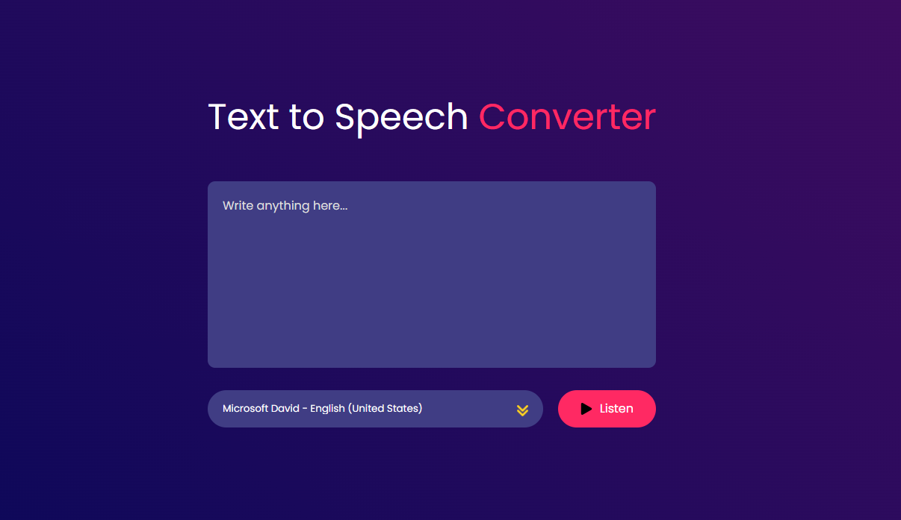

# Text To Voice AI | ABID

A simple web-based Text-to-Speech (TTS) converter that lets users type text and listen to it spoken aloud. This project leverages the Web Speech API for speech synthesis and allows users to select from available voices in the browser.

## Table of Contents
- [Demo](#demo)
- [Features](#features)
- [Installation](#installation)
- [Usage](#usage)
- [Technologies Used](#technologies-used)
- [Contributing](#contributing)
- [License](#license)

## Demo
You can check out the live version of this project [here](#). (Link the live demo if available)

## Features
- **Text-to-Speech Conversion**: Type any text into the input box and hear it spoken aloud.
- **Voice Selection**: Choose from available voices to change how the text sounds.
- **Responsive Design**: Simple and responsive UI built with HTML and CSS.

## Installation
1.https://github.com/abidsarkar/javascript-mini-learning-project/tree/0384965fbe0c85515ddf4816ff3c9d39e2abc1eb/project_5%20Text%20to%20voice

## Usage

    Open the project in your web browser.
    Type or paste text into the text box.
    Select a voice from the dropdown (if multiple voices are available).
    Click the "Listen" button to hear the text spoken aloud.
## Technologies Used

    HTML: Structure of the application.
    CSS: Styling and layout of the application.
    JavaScript: Logic for text-to-speech functionality using the Web Speech API.
## Code Overview

    index.html: Contains the HTML structure for the Text-to-Voice converter.
    textToVoice.css: CSS for styling the page.
    textToVoice.js: JavaScript logic to initialize the speech synthesis and handle the voice selection.
## Contributing

Contributions are welcome! Please feel free to submit a Pull Request.
## License

This template includes sections for the purpose, setup, usage, and relevant technologies in the project. Customize as needed, especially with the demo link if you plan to deploy it online.
